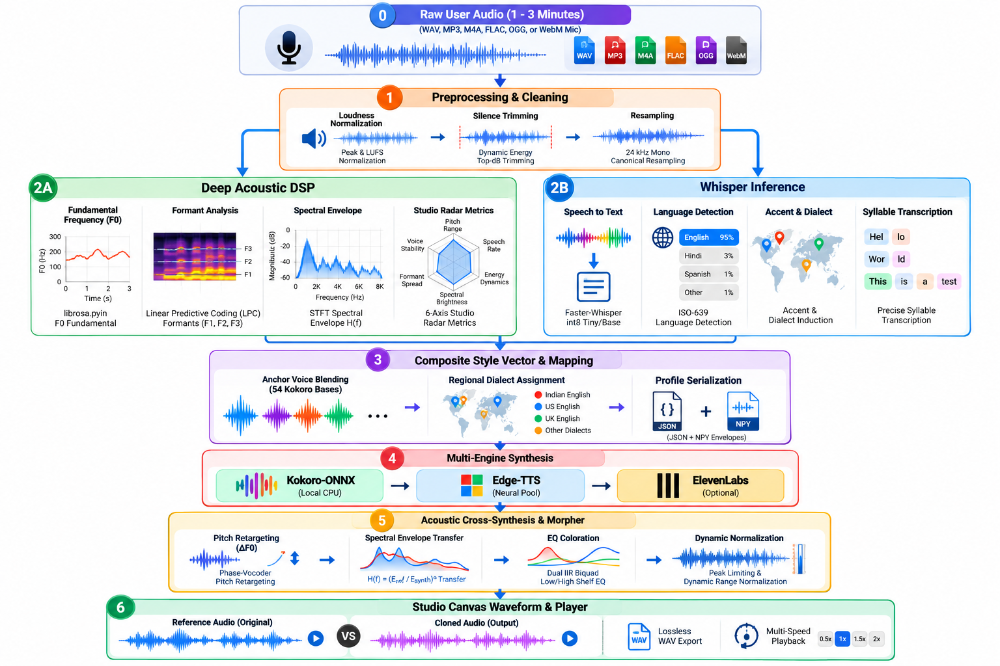
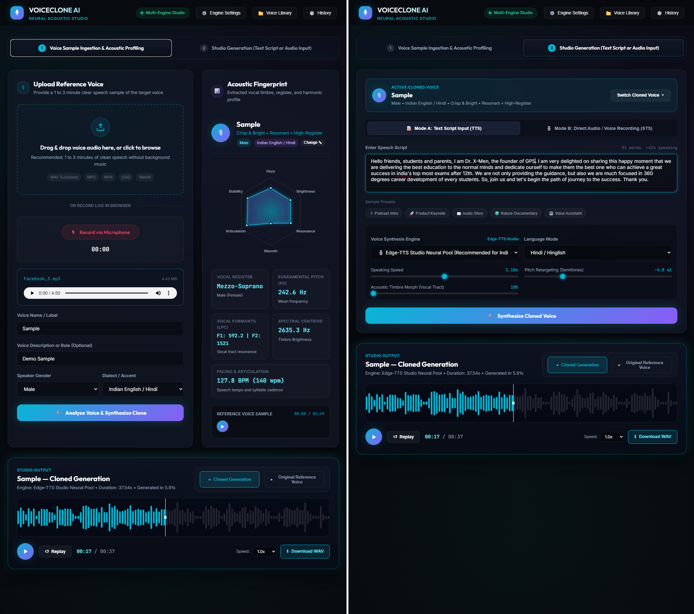

<div align="center">

# 🎙️ VoiceClone AI Studio
### *Neural Acoustic Voice Profiling, Local Speech-to-Speech & Multi-Engine Speech Synthesis*

[](https://github.com/theparmeshkumar/voicecloneai/stargazers)
[](LICENSE)
[](https://python.org)
[](https://fastapi.tiangolo.com)
[](https://onnxruntime.ai)

**Created & Maintained by [Parmesh Kumar](https://github.com/theparmeshkumar)**

<p align="center">
  <a href="#-project-overview">Overview</a> •
  <a href="#-architectural-pipeline--models-deep-dive">Models & Architecture</a> •
  <a href="#-complete-feature-breakdown">Features</a> •
  <a href="#-key-backend-functions">Key Functions</a> •
  <a href="#-quick-start--installation">Installation</a> •
  <a href="#-current-limitations--challenges">Current Challenges</a> •
  <a href="#-how-to-fix-this-issue--technical-roadmap">Fix Roadmap</a> •
  <a href="#-open-collaboration-call">Call for Collaboration</a>
</p>




</div>

---

## 📖 Project Overview

**VoiceClone AI Studio** is a privacy-first, locally deployable audio engineering and voice cloning application. It enables users to record or upload short audio samples (1 to 3 minutes), extract intricate acoustic and vocal tract biometrics, and synthesize new speech in dual operational modes:
1. **Text-to-Speech (TTS)**: Synthesizing typed scripts with fine-grained prosody, pitch, and timbre retargeting.
2. **Speech-to-Speech (STS)**: Re-voicing direct spoken audio or microphone recordings into the target cloned voice with automated offline transcription.

Unlike conventional cloud-tethered voice SaaS products that charge recurring subscription fees and transmit private biometric voice data over the internet, VoiceClone AI Studio was designed from the ground up to operate **locally on standard consumer CPUs** without requiring high-end dedicated GPUs or mandatory cloud credentials.

---

## 🧠 Architectural Pipeline & Models Deep Dive

The platform employs a hybrid acoustic engineering pipeline combining modern quantized deep learning models with classical digital signal processing (DSP):

```
                        ┌───────────────────────────────────────────────┐
                        │        Raw User Audio (1 - 3 Minutes)         │
                        │    (WAV, MP3, M4A, FLAC, OGG, or WebM Mic)     │
                        └───────────────────────┬───────────────────────┘
                                                │
                                                ▼
                        ┌───────────────────────────────────────────────┐
                        │      Stage 1: Preprocessing & Cleaning        │
                        │ • Peak & LUFS Loudness Normalization          │
                        │ • Dynamic Energy Top-dB Silence Trimming      │
                        │ • 24 kHz Mono Canonical Resampling            │
                        └───────────────────────┬───────────────────────┘
                                                │
                     ┌──────────────────────────┴──────────────────────────┐
                     ▼                                                     ▼
    ┌─────────────────────────────────┐                 ┌─────────────────────────────────┐
    │  Stage 2A: Deep Acoustic DSP    │                 │   Stage 2B: Whisper Inference   │
    │ • librosa.pyin F0 Fundamental   │                 │ • Faster-Whisper int8 Tiny/Base │
    │ • Linear Predictive Coding (LPC)│                 │ • ISO-639 Language Detection    │
    │   Formants (F1, F2, F3)         │                 │ • Accent & Dialect Induction    │
    │ • STFT Spectral Envelope H(f)   │                 │ • Precise Syllable Transcription│
    │ • 6-Axis Studio Radar Metrics   │                 └────────────────┬────────────────┘
    └────────────────┬────────────────┘                                  │
                     │                                                   │
                     └──────────────────────────┬────────────────────────┘
                                                │
                                                ▼
                        ┌───────────────────────────────────────────────┐
                        │  Stage 3: Composite Style Vector & Mapping    │
                        │ • Anchor Voice Blending across 54 Kokoro Bases│
                        │ • Regional Neural Dialect Assignment          │
                        │ • Profile Serialization (JSON + NPY Envelopes)│
                        └───────────────────────┬───────────────────────┘
                                                │
                                                ▼
                        ┌───────────────────────────────────────────────┐
                        │         Stage 4: Multi-Engine Synthesis       │
                        │ ┌───────────────┬──────────────┬────────────┐ │
                        │ │ Kokoro-ONNX   │ Edge-TTS     │ ElevenLabs │ │
                        │ │ (Local CPU)   │ (Neural Pool)│ (Optional) │ │
                        │ └───────┬───────┴──────┬───────┴─────┬──────┘ │
                        └─────────┼──────────────┼─────────────┼────────┘
                                  └──────────────┼─────────────┘
                                                 │
                                                 ▼
                        ┌───────────────────────────────────────────────┐
                        │ Stage 5: Acoustic Cross-Synthesis & Morpher   │
                        │ • Phase-Vocoder Pitch Retargeting (ΔF0)       │
                        │ • Spectral Envelope Transfer H(f) = (E_ref /  │
                        │   E_synth)^α                                  │
                        │ • Dual IIR Biquad Low/High Shelf EQ Coloration│
                        │ • Peak Limiting & Dynamic Range Normalization │
                        └───────────────────────┬───────────────────────┘
                                                │
                                                ▼
                        ┌───────────────────────────────────────────────┐
                        │        Studio Canvas Waveform & Player        │
                        │ • Side-by-Side Reference vs. Cloned Audio A/B │
                        │ • Lossless WAV Export & Multi-Speed Playback  │
                        └───────────────────────────────────────────────┘
```

### 1. Kokoro-ONNX (82 Million Parameters)
- **Role**: Primary local, offline neural text-to-speech engine.
- **Architecture**: A lightweight, distilled acoustic neural architecture derived from StyleTTS2 and ISTFTNet principles. Kokoro replaces heavy diffusion steps with an efficient feed-forward duration predictor, text aligner, and an inverse short-time Fourier transform (iSTFT) neural vocoder.
- **ONNX Runtime CPU Optimization**: Model weights (`kokoro-v1.0.onnx`, ~350 MB) run through ONNX Runtime with multi-threaded CPU execution providers (`OMP_NUM_THREADS=4`), achieving faster-than-real-time speech synthesis on modern multi-core x86_64 processors without requiring CUDA.
- **Style Vector Space (`voices-v1.0.bin`)**: Contains pre-trained latent style embeddings representing 54 distinct anchor voices across male and female vocal characteristics. The system constructs a composite speaker vector by projecting the analyzed speaker's gender and pitch profile into linear combinations of these anchor vectors.

### 2. Faster-Whisper (CTranslate2 int8 Quantization)
- **Role**: Real-time speech transcription, dialect classification, and speech-to-speech ingestion.
- **Architecture**: Powered by [Systran's Faster-Whisper](https://github.com/SYSTRAN/faster-whisper), a reimplementation of OpenAI's Whisper model utilizing CTranslate2's fast inference engine.
- **Quantization**: Runs under `compute_type="int8"` on CPU, delivering up to a 4x reduction in memory footprint and up to a 4x speedup over standard PyTorch Whisper implementations.
- **Language & Accent Detection**: Automatically parses reference speech to identify the primary language (e.g. Hindi, English, Spanish) and regional dialect cues (such as Indian English speech syntax), enabling automatic mapping to appropriate regional acoustic voice profiles.

### 3. Edge-TTS Studio Neural Pool
- **Role**: High-fidelity regional neural voice synthesis fallback.
- **Architecture**: Asynchronous Python wrapper (`edge-tts`) interfacing with cloud-edge neural text-to-speech models. Features over 300 studio-quality voices covering regional dialects that are typically under-represented in compact local models (such as `en-IN-PrabhatNeural` and `en-IN-NeerjaNeural` for authentic Indian English inflections).

### 4. ElevenLabs Voice API (Optional 1:1 Cloud Fallback)
- **Role**: Premium zero-shot cloud voice cloning fallback for users requiring commercial-grade similarity.
- **Integration**: Pluggable via user-provided API key in the studio settings modal. Utilizes ElevenLabs' `eleven_multilingual_v2` model with automatic reference WAV upload and cached speaker ID retention.

### 5. Acoustic Digital Signal Processing (DSP) & Cross-Synthesis Morpher
To bridge the gap between fixed synthetic voices and the physical characteristics of the target user's vocal tract, the platform features a dedicated DSP cross-synthesis pipeline (`backend/audio_processor.py`):
- **Probabilistic YIN Pitch Tracking (`librosa.pyin`)**: Extracts the fundamental frequency ($F_0$) contour over voiced speech frames ($65\text{ Hz} \le F_0 \le 400\text{ Hz}$), computing median, minimum, maximum, and pitch variation standard deviation.
- **Phase-Vocoder Pitch Retargeting**: Calculates the musical semitone interval between the generated voice and the target speaker's natural median pitch:
  $$\Delta \text{semitones} = 12 \cdot \log_2\left(\frac{F_{0, \text{target}}}{F_{0, \text{synth}}}\right)$$
  The synthesized waveform is shifted along the frequency scale via a phase-vocoder while preserving temporal pacing.
- **Smoothed STFT Spectral Envelope Transfer**:
  The physical dimensions of a person's oral and pharyngeal cavities create distinct resonance frequencies (formants). The system computes the smoothed Short-Time Fourier Transform envelope ($E_{\text{ref}}$) of the speaker:
  $$H(f) = \left( \frac{E_{\text{ref}}(f)}{\max(E_{\text{synth}}(f), \epsilon)} \right)^\alpha$$
  Where $\alpha \in [0.0, 1.0]$ represents the user-controlled warmth mix. Applying this filter kernel $H(f)$ in the frequency domain transfers the physical formant coloring of the target voice onto the synthetic speech.
- **Linear Predictive Coding (LPC) Formant Analysis**: Solves the all-pole filter coefficients via Levinson-Durbin recursion on pre-emphasized audio ($y[n] - 0.97 y[n-1]$) to identify formants $F_1, F_2, \text{and } F_3$.
- **Parametric Biquad Equalization**: IIR 2nd-order Butterworth low-shelf and high-shelf filters modulate warmth and presence based on the speaker's acoustic profile.

---

## ✨ Complete Feature Breakdown

| Feature | Description |
| :--- | :--- |
| **🎙️ Multi-Format Voice Ingestion** | Ingest voice samples (1 to 3 minutes) via drag-and-drop or file selector (`.wav`, `.mp3`, `.m4a`, `.ogg`, `.flac`, `.webm`). Alternatively, record live in-browser using the Web Audio API with a dynamic real-time decibel meter and visualizer. |
| **📊 6-Axis Acoustic Radar Profiling** | Quantifies vocal characteristics into a normalized 6-dimensional radar chart: **Pitch ($F_0$)**, **Brightness (Centroid)**, **Warmth**, **Resonance**, **Articulation**, and **Stability**. Classifies vocal registers from Bass, Baritone, and Tenor to Contralto, Mezzo-Soprano, and Soprano. |
| **📝 Mode A: Text-to-Speech Studio** | Type or paste any custom script. Includes one-click narrative presets (*Podcast Intro, Product Keynote, Audio Story, Documentary, Assistant*), dynamic word counter, speaking duration estimator, and granular sliders for Speed (0.7x - 1.5x), Semitone Pitch Retargeting (-8st to +8st), and Vocal Tract Warmth (0% - 100%). |
| **🗣️ Mode B: Speech-to-Speech Re-Voicing** | Record directly or upload an audio file containing spoken words. Faster-Whisper transcribes the audio in approximately 1 second, displays the recognized text in an editable editor, and re-synthesizes the entire speech in the cloned voice. |
| **🎛️ Interactive Canvas Waveform Player** | Visual HTML5 Canvas audio player rendering the full frequency amplitude envelope. Supports click-to-scrub time seek, interactive playhead cursor, dynamic timestamps, playback speed controls (0.75x, 1.0x, 1.25x, 1.5x), and lossless 24kHz `.wav` download. |
| **🔄 Side-by-Side A/B Voice Comparison** | Instant one-click toggle in the studio player allowing users to switch between the newly synthesized cloned audio and the original recorded reference voice to evaluate similarity, timbre, and naturalness. |
| **📚 Voice Profile Manager & Trait Editor** | Library storing all created voices locally with metadata (sample duration, creation timestamp, detected accent, gender). Built-in modal allows live editing of voice name, gender tags, and regional accent overrides. |
| **⚙️ Global Settings Modal** | Change default synthesis engines (Auto-Optimal, Kokoro Local, Edge-TTS Neural, ElevenLabs), configure cloud API credentials, and monitor server and model health. |
| **🎨 Modern Glassmorphism UI** | Designed with vanilla CSS, custom HSL color palettes, backdrop filters, responsive CSS grid layouts, smooth micro-interactions, and accessible typography. |

---

## 🛠️ Key Backend Functions

### In `backend/audio_processor.py`:
- `load_and_normalize_audio(file_path, target_sr=24000)`: Robust loader supporting multiple audio codecs with peak normalization, silence trimming, and 24kHz mono resampling.
- `extract_acoustic_profile(y, sr)`: Extracts fundamental frequency statistics ($F_0$), vocal registers, LPC formants ($F_1, F_2, F_3$), spectral centroid, spectral rolloff, spectral contrast, tempo/BPM, and radar metric normalization.
- `compute_spectral_envelope(y, sr, n_fft=2048, hop_length=512)`: Calculates the smoothed magnitude STFT curve capturing vocal tract resonances across voiced frames while eliminating pitch harmonics.
- `apply_timbre_morph(synth_audio, ref_profile, ref_env, sr=24000, mix=0.65, pitch_shift_semitones=0.0)`: Performs pitch retargeting via phase-vocoder, transfers the reference spectral envelope, and applies parametric EQ coloration.
- `transcribe_audio(audio_path)`: Uses Faster-Whisper on CPU to produce word-level timestamps, transcripts, and language classification metrics.

### In `backend/cloner.py`:
- `VoiceClonerEngine.__init__()`: Initializes the local ONNX model and loads the 54 base voice style embeddings.
- `detect_accent_and_language(audio_path)`: Uses acoustic and phonetic cues to detect speaker dialect (e.g. Indian English vs. American vs. British).
- `analyze_and_create_clone(...)`: Ingests reference audio, runs acoustic profiling, computes composite style vectors, saves reference artifacts, and registers a new profile.
- `generate_speech_from_text(...)`: Multi-engine dispatcher (Kokoro, Edge-TTS, or ElevenLabs) followed by DSP timbre morphing.
- `convert_speech_to_speech(...)`: End-to-end pipeline: Input Audio → Whisper Transcription → Script Verification → Cloned Synthesis → Acoustic Post-Processing.

### In `backend/storage.py`:
- `save_profile(profile_data)` / `get_profile(clone_id)` / `delete_profile(clone_id)`: Atomic JSON persistence managing voice profile registries in `data/profiles/profiles.json`.
- `add_history_entry(entry)` / `list_history()`: Logs generation records, execution durations, script texts, and audio output paths in `data/outputs/history.json`.

---

## 🚀 Quick Start & Installation

### Prerequisites
- **Operating System**: Windows 10/11, macOS, or Linux.
- **Python**: Version `3.10` or higher.
- **FFmpeg**: Required for handling varied audio file formats (`.mp3`, `.m4a`, `.ogg`, `.webm`).
  - *Windows (winget)*: `winget install Gyan.FFmpeg`
  - *macOS (homebrew)*: `brew install ffmpeg`
  - *Ubuntu/Debian*: `sudo apt-get install ffmpeg`

### 1. Clone the Repository
```bash
git clone https://github.com/theparmeshkumar/voicecloneai.git
cd voicecloneai
```

### 2. Set Up Virtual Environment & Dependencies
```bash
# Create virtual environment
python -m venv .venv

# Activate virtual environment
# Windows (PowerShell):
.venv\Scripts\Activate.ps1
# Linux / macOS:
source .venv/bin/activate

# Install dependencies
pip install -r requirements.txt
```

### 3. Download Local Neural Models (Kokoro ONNX)
Run the automated model downloader script to retrieve the Kokoro weights (~350MB) and style vectors:
```bash
python download_models.py
```
*(Note: If you skip this step, the engine will automatically attempt to download missing files on its first launch.)*

### 4. Launch the Application
- **Windows double-click**: Run `start.bat`
- **Command Line**:
```bash
python run.py
```
The server will initialize at `http://localhost:8000` and automatically open the studio interface in your default web browser.

---

## 📁 Repository Structure

```
voicecloneai/
├── backend/
│   ├── app.py              # FastAPI application, routing, and REST endpoints
│   ├── audio_processor.py  # DSP algorithms (pYIN, LPC, spectral envelope transfer, Whisper)
│   ├── cloner.py           # Multi-engine coordinator, Kokoro ONNX, Edge-TTS, ElevenLabs
│   └── storage.py          # JSON data store for voice profiles, history, and settings
├── frontend/
│   ├── index.html          # Responsive studio web interface
│   ├── css/
│   │   └── style.css       # Custom Glassmorphic design system and responsive UI
│   └── js/
│       ├── app.js          # Studio coordinator, UI state, generation flow
│       ├── audio_player.js # Interactive HTML5 Canvas waveform player
│       ├── audio_recorder.js# Web Audio API microphone capture with decibel meter
│       └── visualizer.js   # 6-axis acoustic radar chart visualizer
├── models/
│   ├── kokoro-v1.0.onnx    # Neural TTS weights (auto-downloaded, excluded from git)
│   └── voices-v1.0.bin     # 54 base voice embeddings (auto-downloaded)
├── data/
│   ├── profiles/           # Local saved voice profiles and reference WAV files
│   └── outputs/            # Local generated speech output files
├── download_models.py      # Automated script for downloading model checkpoints
├── requirements.txt        # Python package dependencies
├── run.py                  # Entry-point launcher script
├── start.bat               # Windows quick-launch batch file
├── .gitignore              # Configured to prevent large binaries or temp audio commits
└── README.md               # Technical project documentation
```

---

## ⚠️ Current Limitations & Technical Challenges

While the current architecture provides responsive, privacy-preserving, and completely offline speech generation on standard consumer CPUs, **it currently does not achieve 100% exact acoustic identity matching to the reference audio**. 

Understanding the technical reasons for this discrepancy is essential:

### 1. Style Space Projection vs. True Latent Speaker Cloning
- **Current Approach**: Kokoro-ONNX operates on a fixed manifold of 54 pre-trained voice style vectors. The current cloning algorithm approximates a voice by computing a weighted average (linear interpolation) of the closest matching pre-existing voices based on gender and pitch.
- **The Problem**: A linear blend of existing pre-trained voices creates a pleasant, high-quality composite voice, but it remains confined to the convex hull of the 54 base voices. It cannot represent unique, un-modeled idiosyncratic vocal signatures, nasal nuances, or unique accents that exist outside this pre-trained subspace.

### 2. Spectral Envelope Transfer vs. Neural Prosodic Flow
- **Current Approach**: The platform uses DSP cross-synthesis ($H(f) = (E_{\text{ref}} / E_{\text{synth}})^\alpha$) to reshape the synthetic audio's spectral envelope to match the reference vocal tract formants.
- **The Problem**: While this modifies frequency coloration (making the output sound more resonant or warmer), it is an acoustic post-processing filter. It **cannot alter the underlying neural prosody**, intonation curves, micro-pauses, dialectal stress patterns, or phoneme durations produced by the base TTS model.

### 3. The CPU vs. GPU Performance Constraint
- Full zero-shot neural voice cloning models typically rely on large continuous-time diffusion backbones or auto-regressive audio language models with 300M to 1B+ parameters. Running such architectures natively on consumer CPUs without GPU acceleration often results in high latency (e.g. 30–60 seconds of processing for 5 seconds of audio), making interactive browser use challenging.

---

## 🛠️ How to Fix This Issue & Technical Roadmap

To achieve true, broadcast-grade 1:1 voice cloning that runs efficiently, the project has established the following technical roadmap:

```
[Phase 1: Present]             [Phase 2: Hybrid Zero-Shot]        [Phase 3: True On-Device 1:1]
Kokoro Composite Style     ──▶  Open-Source Zero-Shot        ──▶  Quantized Neural Vocoder
+ DSP Envelope Morpher          Model Integration                 + Few-Shot Audio LoRA
(Fast, CPU-Friendly)            (F5-TTS / CosyVoice / XTTS)        (Exact Speaker Replica)
```

### Proposed Solutions & Engineering Steps:

1. **Integrate True Open-Source Zero-Shot Cloning Models**:
   - **F5-TTS (Non-Autoregressive Flow Matching)**: Integrates deep flow-matching diffusion models capable of true zero-shot voice cloning from just 3 to 10 seconds of reference speech.
   - **CosyVoice 2 / ChatTTS**: Multi-lingual zero-shot voice cloning architectures with natural conversational inflections.
   - **XTTS-v2 / Coqui**: End-to-end multi-lingual voice cloning with direct speaker embedding conditioning.

2. **Quantization & Efficient CPU / DirectML / ONNX Export**:
   - Convert zero-shot conditioning modules into **ONNX Runtime (int8 / fp16)** or **GGUF** formats (similar to `llama.cpp` for audio) so they run in real time on multi-core CPUs and integrated GPUs (via DirectML on Windows and Metal on macOS).

3. **Neural Speaker Embedding Extractor (ECAPA-TDNN / WavLM)**:
   - Replace heuristic pitch and LPC metrics with a dedicated speaker verification embedding model (such as **ECAPA-TDNN** or **WavLM-SV**).
   - Use the extracted 192-dimensional d-vector to condition a neural vocoder (such as **BigVGAN** or **HiFi-GAN**) directly, bypassing the limitations of linear style interpolation.

4. **Optional Few-Shot LoRA Adaptation**:
   - Implement an optional background training task that takes the 1–3 minute sample and fine-tunes a tiny adapter layer (LoRA) specifically for that speaker in under 2 minutes on GPU/NPU.

---

## 🤝 Open Collaboration Call

**We are actively seeking collaborators, AI researchers, audio DSP engineers, and open-source contributors!**

If you are passionate about open-source audio AI, speech synthesis, zero-shot voice cloning, or ONNX acceleration, we would love your help to take VoiceClone AI Studio to the next level.

### Priority Areas for Contribution:
- [ ] **Zero-Shot Engine Integration**: Implement a modular backend adapter for **F5-TTS**, **CosyVoice 2**, or **XTTS-v2**.
- [ ] **ONNX / TensorRT / OpenVINO Optimization**: Quantize zero-shot models for fast CPU/iGPU execution.
- [ ] **Speaker Conditioning**: Integrate ECAPA-TDNN / Resemblyzer d-vector extraction into the synthesis loop.
- [ ] **UI & Waveform Enhancements**: Add multi-track audio editing, spectrogram visualizations, and advanced pitch contour curves.
- [ ] **Cross-Platform Packaging**: Create Docker containers, Linux AppImages, and one-click installers for Windows/macOS.

### How to Contribute:
1. **Fork the Repository**: Click the `Fork` button at the top right of [the GitHub repo](https://github.com/theparmeshkumar/voicecloneai).
2. **Create a Feature Branch**: `git checkout -b feature/amazing-voice-engine`
3. **Commit Your Changes**: `git commit -m "Add zero-shot cloning adapter using F5-TTS"`
4. **Push to Your Branch**: `git push origin feature/amazing-voice-engine`
5. **Open a Pull Request**: Submit your PR on GitHub with a description of your work.

Feel free to open an **[Issue](https://github.com/theparmeshkumar/voicecloneai/issues)** or start a **[Discussion](https://github.com/theparmeshkumar/voicecloneai/discussions)** to brainstorm implementation strategies or ask questions.

---

## 📜 Copyright & License

```
Copyright (c) 2026 Parmesh Kumar. All rights reserved.
GitHub: https://github.com/theparmeshkumar
```

This project is licensed under the **MIT License** — you are free to use, modify, and distribute this software in personal or commercial projects with proper attribution. See the [LICENSE](LICENSE) file for full details.

---

<div align="center">
  <sub>Built with ❤️ by <a href="https://github.com/theparmeshkumar">Parmesh Kumar</a>. If you find this project useful or interesting, please give it a ⭐ on GitHub!</sub>
</div>
